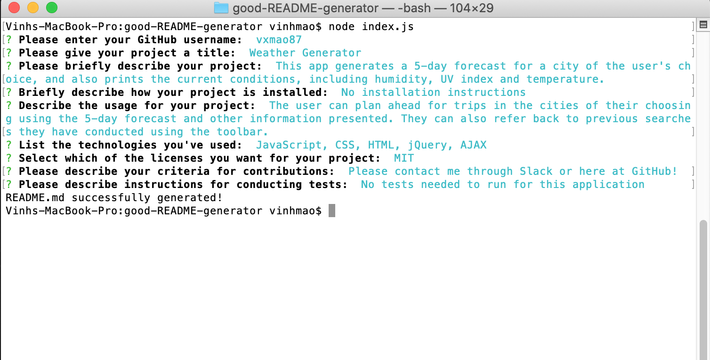

# good-README-generator

Creating a feasible README is essential for any project, and a missing or insufficient one is not in the best interest of anyone wanting to view one. However, sometimes it is a hassle to create one because of the larger need to write up actual code in place of describing the project. 

With this app, you can create a README that will need a few edits, but also serves as a great starter template.

## Table of Contents 

* [Installation](#installation)

* [Description](#description)

* [Technologies](#technologies)

* [Reflection](#reflection)

# Installation

```
npm i
```
The above command is used to run the README generator.

# Description

The project:

1. Uses NPM to write and create files
2. Follows a uniform syntax for generating a feasible project README

# Technologies

* JavaScript
* JSON
* Axios
* NPM

# Reflection

Throughout this project, I have learned a great deal in organizing all of my code into smaller files to achieve better readability and accessibility. Though this template is only a starter and several edits will be needed to perfect the generated README, it saves a great amount of time.



Please watch a video of the project implementation [here](https://drive.google.com/file/d/1jQHkcHixvc_CyqNjjsYYwNx5TUXez7uc/view?usp=sharing): 


